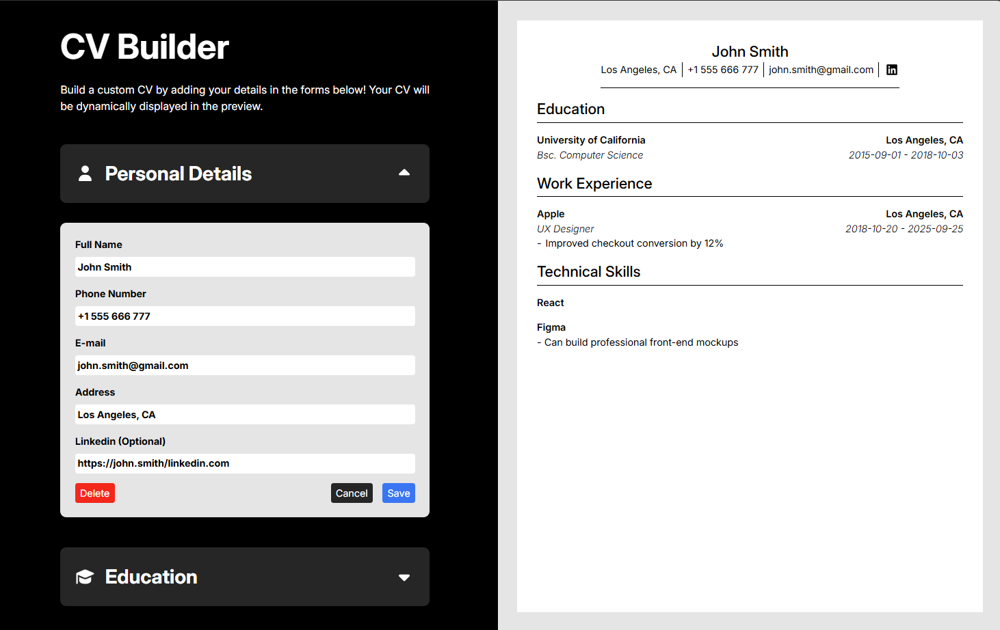

# CV Application

A CV/Resume builder built with React. Add your details in the forms and generate a clean CV preview.

## About This Project

This is a CV Application project built as part of my learning journey with [The Odin Project](https://www.theodinproject.com/) (React).

## What I Learned

This was my first React project. Through it, I learned when and where to define state, how to pass and manage props, and how to think in reusable "components". I learned a lot and I’m excited to keep using React to build larger web apps faster.

## Technologies And Tools Used

- React
- Vite
- JavaScript
- HTML5
- CSS3
- ESLint

## Getting Started

1. Install dependencies: `npm install`
2. Run the dev server: `npm run dev`
3. Open the local URL Vite prints (usually `http://localhost:5173`)

## Live Demo

- Netlify: https://cv-builder-project-jayendra.netlify.app/

## Screenshots

## Resources

### Icons
https://fontawesome.com/icons/graduation-cap?f=classic&s=solid
https://fontawesome.com/icons/user?f=classic&s=solid
https://fontawesome.com/icons/briefcase?f=classic&s=solid
https://fontawesome.com/icons/list-check?f=classic&s=solid
https://fontawesome.com/icons/caret-down?f=classic&s=solid
https://fontawesome.com/icons/caret-up?f=classic&s=solid
https://fontawesome.com/icons/plus?f=classic&s=solid
https://fontawesome.com/icons/pen-to-square?f=classic&s=solid
https://fontawesome.com/icons/linkedin?f=brands&s=solid

### Typography
https://fonts.google.com/specimen/Inter
https://fonts.google.com/specimen/Playfair
